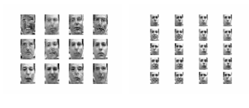

This project was implemented in the contect of the Advanced Machine Learning course (KTH) and aims at replicating the main finding of the study titled  "VAE with a VampPrior" authored by Tomczak Jakub and Max Welling.

    

